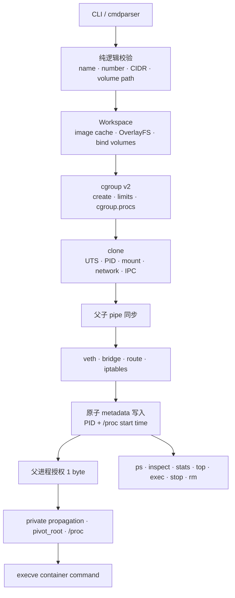

# tinydocker

`tinydocker` 是一个用 C 编写的教学型 Linux 容器运行时。它把 namespace、cgroup v2、OverlayFS、`pivot_root`、进程同步、状态文件和基础 bridge/veth/iptables 网络串成一条可阅读、可调试的容器启动链，适合作为 Linux、容器与系统编程求职项目。

它不是 Docker、containerd 或 runc 的替代品，也不是生产级安全边界。项目不兼容 OCI Runtime Specification，没有 daemon、镜像仓库、seccomp、capability 收敛、user namespace 或完整并发控制；请只在可丢弃的 Linux VM 中运行特权功能。

## 项目目标

- 用较小的 C 代码库展示容器运行时的关键系统调用和资源生命周期。
- 让输入校验、父子进程同步、错误回滚、PID 身份、metadata、cgroup 文件解析和 cleanup 可以被面试讨论与非特权测试覆盖。
- 清楚区分“已实现的教学能力”“需要 Linux/root 的集成能力”和“生产运行时必须具备但本项目不支持的能力”。

## 架构与执行流程



`run` 的关键顺序是：

1. 校验容器名、资源数值、CIDR、端口与卷目标路径。
2. 准备镜像只读层、upperdir、workdir、OverlayFS mountpoint 和 bind volume。
3. 创建 cgroup v2 子目录并写入 `cpu.max`、`memory.max` 和 `cgroup.procs`。
4. `clone()` 创建 UTS、PID、mount、network、IPC namespace；项目不创建 user namespace。
5. 子进程在 pipe 上等待；父进程完成 cgroup、veth/bridge、路由、iptables 和 metadata。
6. 父进程只写入一个明确的授权字节；EOF、短读或父进程失败都会让子进程拒绝执行用户命令。
7. 子进程设置 private mount propagation，执行 bind mount、`pivot_root`、旧 root 卸载和 `/proc` 挂载，最后 `execve()`。

前台 `run` 会转发 `SIGINT`、`SIGTERM`、`SIGHUP` 并可靠 `waitpid()`；`exec` 使用 namespace worker，再 fork 真正的命令进程，避免把宿主 CLI 自身移入容器 cgroup。

## 实现范围

| 区域 | 已实现 | 明确未实现 |
|---|---|---|
| Namespace | UTS、PID、mount、network、IPC；`exec` 使用 namespace fd + `setns()` | user namespace、time namespace、完整 id mapping |
| 文件系统 | 单 lowerdir OverlayFS、upper/work/mountpoint、bind volume、只读 remount、`pivot_root`、独立 `/proc` | OCI rootfs、多个镜像 layer metadata、完整 archive/symlink 恶意输入防护、只读 rootfs 策略 |
| cgroup v2 | v2 检测、容器 cgroup 创建、`cpu.max`、`memory.max`、`cgroup.procs`、CPU/memory/pids stats | 自动启用父级 controller、`pids.max` 配置、systemd/DBus 管理、delegation、压力指标 |
| 网络 | bridge、唯一 veth pair、容器地址/默认路由、OUTPUT/PREROUTING DNAT、MASQUERADE；网络状态严格解析、writer lock + 原子替换 | CNI、IPv6、DNS、网络 namespace 持久化、策略隔离 |
| 生命周期 | run、ps、inspect、stats、top、exec、stop、rm、commit、network create/ls/rm | daemon、restart policy、checkpoint/restore、健康检查 |
| 安全 | 名称/路径/数值/CIDR 校验、无 shell 命令构造、metadata `O_NOFOLLOW` + 原子 rename、PID start-time 校验、保守 cleanup | seccomp、LSM、capability drop、rootless、签名镜像、生产级并发与审计 |

## 状态、inspect、stats 与 cleanup

每个容器在 `container_info` 下有一个 metadata 文件。写入过程使用同目录临时文件、`fsync()` 和原子 `renameat()`；读取时拒绝 symlink、非普通文件、超大文件、缺失字段、重复字段、非法状态和文件名/内部名称不一致。

metadata 同时记录 PID 和 `/proc/<pid>/stat` 的 start time：

- `ps`、`inspect`、`stats` 会执行 lazy refresh。
- PID 不存在，或相同 PID 的 start time 已变化时，`RUNNING` 会原子更新为 `EXITED`。
- 旧 metadata 没有 start time 时仍可读取，但会明确警告无法排除 PID reuse。
- 这是无 daemon 设计下的惰性校正，不是强一致状态机。

`inspect` 输出名称、PID、状态、镜像、命令、时间、IP、cgroup/rootfs 路径及其当前可用性、卷信息。端口映射尚未持久化，因此仍显示 `PortMappings: unavailable`。

`stats` 是一次性 cgroup v2 快照，读取：

- `cpu.stat` 的 `usage_usec`
- `memory.current` / `memory.max`
- `cpu.max`
- `pids.current` / `pids.max`

cgroup 已删除或指标文件不可读时会明确警告并输出 `N/A`，不会假装指标有效。

cleanup 遵循“先停止进程，再卸载 volume/rootfs，再清网络，再删 workspace/cgroup，最后删 metadata”的思路。重复删除缺失文件/目录按成功处理；如果 mount 可能仍然存在，代码会拒绝递归删除 workspace，并保留 metadata 供再次检查，而不会跨过失败继续做危险清理。

## 仓库结构

```text
cmdparser/   CLI 与参数结构
core/        可跨平台测试的校验、状态 codec、cgroup parser、fs/process helper
docker/      lifecycle、namespace、cgroup、workspace、volume、network、observability
logger/      轻量日志实现
tests/       非特权 C 测试、显式 opt-in 的特权集成测试
.github/     默认只执行安全测试的 CI
```

## 构建环境

运行时二进制只能在 Linux 构建和运行。建议使用 Debian 12、Ubuntu 22.04/24.04 或等价的可丢弃 VM，内核启用 cgroup v2 和 OverlayFS。

Linux 构建依赖：

```bash
apt-get update
apt-get install -y build-essential libssl-dev bridge-utils iproute2 iptables tar
make clean
make
```

上面的包安装会修改 VM，应该由用户在隔离环境中显式执行；本地测试和演示脚本不会自动调用 `sudo`。GitHub Actions 只在一次性托管 runner 中安装构建依赖。

默认 runtime 和 cgroup parent 保留原项目路径，但可在构建时覆盖：

```bash
make RUNTIME_DIR=/var/lib/tinydocker \
     CGROUP_PARENT=/sys/fs/cgroup/tinydocker.slice
```

使用自定义 cgroup parent 前，必须由管理员创建并正确 delegation；tinydocker 不会创建未知的宿主机父层级，也不会自动修改 `cgroup.subtree_control`。

macOS 不能构建运行时二进制，因为没有 Linux `clone/setns/mount/pivot_root` 与 cgroup API。`make` 会给出明确错误，但纯逻辑测试仍可运行。

## 安全的非特权验证

以下命令不会创建容器、namespace、mount、网络设备、iptables 规则或真实 cgroup：

```bash
make test          # 非特权行为测试
make static-check  # macOS: core；Linux: 全部源码严格 -Werror 检查
make sanitize      # core tests + ASan + UBSan
make check         # 依次执行以上三项
```

当前非特权覆盖包括：

- 容器名与保留路径组件校验
- 严格整数、端口和 IPv4 CIDR 解析
- volume `host:container[:ro|rw]` 配置解析与路径穿越拒绝
- runtime 路径与 rootfs 内路径生成
- symlink 下的安全目录创建
- cgroup stat、byte value 和 `cgroup.procs` 解析
- `/proc/<pid>/stat` start time 解析
- metadata 严格解析、错误信息和读写 round-trip
- network state 严格解析、容量/重复 IP/CIDR 边界和读写 round-trip
- archive entry 基础路径穿越检查
- cleanup 缺失资源幂等性
- 无 shell 的子进程执行与输出捕获
- veth 名长度和碰撞规避

GitHub Actions 默认只运行 Linux build、非特权测试、严格静态编译与 sanitizer；不会运行特权集成测试。

## 特权集成测试

特权测试会修改 namespace、mount、cgroup、veth/bridge 和 iptables。它们默认拒绝执行，不会自动调用 `sudo`，并要求已经处于可丢弃 Linux VM 的 root shell。测试从 `mktemp` 目录后缀生成唯一容器名和网络名，先只读确认名称不存在，随后只清理由本次流程标记为 owned 的资源；不接受外部指定测试 run ID。

审查脚本后，显式选择一个 suite：

```bash
TINYDOCKER_ALLOW_PRIVILEGED_TESTS=1 \
PRIVILEGED_SUITE=observability \
bash tests/run_privileged.sh

TINYDOCKER_ALLOW_PRIVILEGED_TESTS=1 \
PRIVILEGED_SUITE=full \
bash tests/run_privileged.sh
```

前置条件：Linux、root、cgroup v2、OverlayFS、`ip`、`brctl`、`iptables`、`nsenter`、`tar`，以及与 VM CPU 架构匹配的 rootfs。详细清单见 [完整功能测试说明](docs/FULL_FUNCTION_TEST.md)。

## 演示

只在可丢弃 VM 中，以已经确认的 root shell 执行：

```bash
make
TINYDOCKER_ALLOW_PRIVILEGED_DEMO=1 bash demo.sh
```

演示使用唯一容器名，依次展示 build、run、inspect、stats、stop、rm。若 runtime cleanup 留下已知 artifact，脚本只报告路径并失败，不会直接用 `rm -rf`、`umount` 或 cgroup 删除作为兜底。

也可以手工运行一个最小容器：

```bash
./tinydocker run -d -n demo busybox.tar.xz /bin/sh -c 'sleep 120'
./tinydocker inspect demo
./tinydocker stats demo
./tinydocker stop -t 1 demo
./tinydocker rm demo
```

这些命令本身需要 root，并会修改该 VM 的 mount、network、iptables 和 cgroup 状态。

## 与 Docker / runc 的差异

| tinydocker | Docker / containerd / runc 生态 |
|---|---|
| 教学代码库，单 CLI 直接管理宿主资源 | OCI spec、daemon/shim、成熟生命周期协议 |
| 自定义文本 metadata | 标准 bundle/state、持久化数据库与事件流 |
| 单 layer/rootfs + 简化 commit | 内容寻址镜像、manifest、layer、registry |
| root-only，权限面较大 | rootless/userns、capability、seccomp、LSM 等安全机制 |
| 基础 bridge/veth/iptables | CNI/libnetwork、DNS、IPv6、策略和插件生态 |
| lazy refresh | daemon 持续监控、事件与恢复机制 |
| 局部回滚和保守 cleanup | 经大规模故障注入验证的资源事务与兼容性 |

因此简历或面试中应称其为“教学型容器运行时 / Linux 系统编程项目”，不要描述为 Docker 或 runc 的完整替代品。

## 风险警告

- 运行时使用 root，代码缺少 user namespace、seccomp、capability drop 和 LSM policy；容器内 root 不是可信安全边界。
- bridge、veth 和 iptables 都是宿主机全局资源；命令失败、进程崩溃或断电仍可能留下残余。
- archive 目前会拒绝绝对路径和 `..` entry，并无 shell 注入，但没有完整实现生产级 tar symlink/hardlink 恶意输入模型；只使用可信 rootfs。
- metadata 原子更新避免半写文件，但没有跨所有命令的事务锁；并发 lifecycle 操作仍可能产生逻辑竞争。
- PID start time 大幅降低 PID reuse 误判，但 signal 前仍存在很窄的检查/使用竞争；没有使用 pidfd 完成全程身份绑定。
- cgroup parent、controller delegation 和 systemd 交互依赖宿主配置；本项目不自动修复宿主层级。
- 网络 metadata 仍是简化文本格式；虽然已有严格 codec、`O_NOFOLLOW`、writer lock 和原子替换，但宿主 bridge/veth/iptables 变化与文件更新不是单个事务。端口映射没有持久化到容器 metadata。
- `commit` 是 mountpoint 的 tar 快照，不是 OCI image，也不保存运行配置或网络配置。

## 已知限制

- 仅 Linux；没有 macOS/Windows 运行能力。
- 仅 cgroup v2；默认 parent 为 `/sys/fs/cgroup/system.slice`。
- 不支持 OCI runtime/image spec、registry、pull/push、tag、multi-arch manifest。
- 不支持 user namespace、rootless、seccomp、AppArmor/SELinux profile 或 capability 管理。
- 不支持 `pids.max` 命令行限制、CPU weight、I/O controller、OOM policy。
- 不支持 daemon、自动重启、日志轮转、事件订阅、健康检查、checkpoint/restore。
- 网络仅为教学用 IPv4 bridge；没有 DNS、IPv6、CNI 或防火墙策略隔离。
- 特权路径无法在本仓库的默认 CI 中安全做端到端验证，必须由用户在隔离 VM 中手动确认。

## 进一步阅读

- [完整功能测试说明](docs/FULL_FUNCTION_TEST.md)
- [容器原理学习笔记](docker.md)
