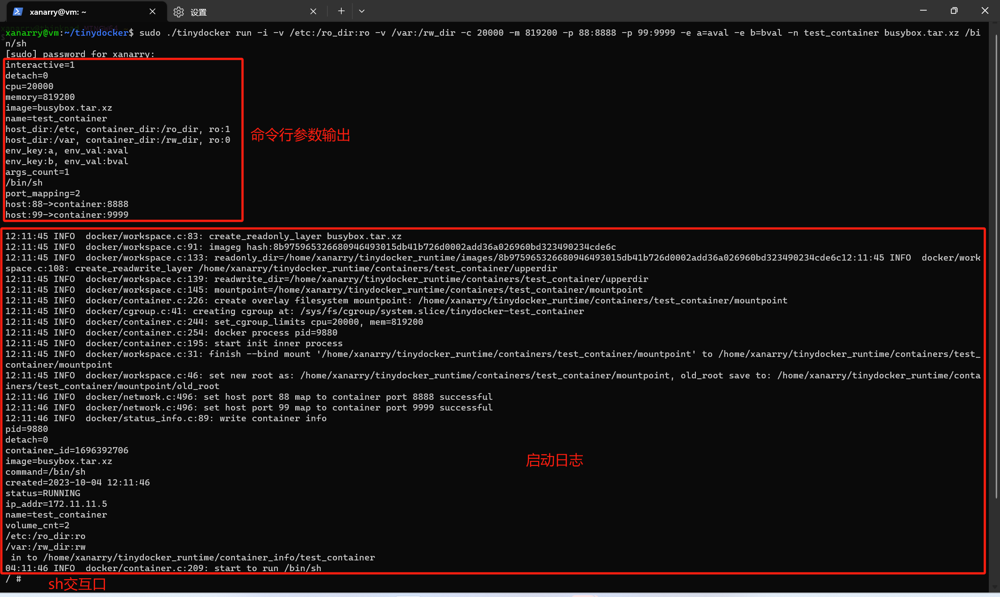
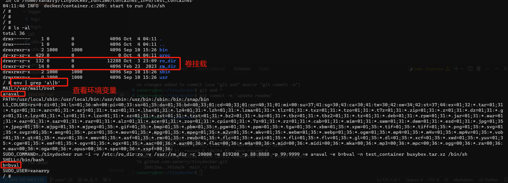

# tinydocker

基于 `xanarry/tinydocker` 的 C 语言轻量级容器运行时二次开发分支。原项目用于学习 Docker/容器运行时的核心机制，支持 namespace、cgroup v2、overlayfs、卷挂载、桥接网络、端口映射以及 `run/ps/stop/rm/exec/top/commit` 等基础命令。

本分支重点补充容器可观测性、无 daemon 场景下的状态修正，以及 metadata/命令解析/失败路径的健壮性加固。它仍然是教学型轻量容器运行时，不是生产级 Docker、containerd 或 runc。


### 文件说明

```bash
./
├── busybox.tar.xz # 容器运行目录
├── cmdparser # 命令行解析
│   ├── cmdparser.c
│   └── cmdparser.h
├── docker # docker实现代码
│   ├── cgroup.c # cgroup v2支持
│   ├── cgroup.h
│   ├── container.c # 容器核心代码
│   ├── container.h
│   ├── network.c #容器网络支持
│   ├── network.h
│   ├── status_info.c #容器状态信息记录
│   ├── status_info.h
│   ├── volumes.c # 容器卷挂载支持
│   ├── volumes.h
│   ├── workspace.c # 容器工作目录管理
│   └── workspace.h
├── logger 日志库, 这个引用的https://github.com/rxi/log.c
│   ├── log.c
│   └── log.h
├── main.c # 命令行入口
├── makefile
├── README.md
├── test.c # 临时测试使用的代码
└── util  # 一些工具函数
    ├── utils.c
    └── utils.h
```


### 版本特性支持与变化

| git tags | 说明                                                         |
| -------- | ------------------------------------------------------------ |
| v1.0     | Version 1.0, 开启基本的命名空间隔开与容器命令执行            |
| v2.0     | Version 2.0, 添加对容器的cgroup资源限制, 支持cgroup v2, 可以限制cpu和内存 |
| v3.0     | Version 3.0, 支持容器新的设置根目录, 设置方式是将镜像地址填成一个本地目录 |
| v4.0     | Version 4.0, 支持容器overlayfs, 容器里面的变更不再影响挂载的根目录, 支持tar包作为镜像地址(即运行根目录) |
| v5.0     | Version 5.0, 支持卷挂载(支持挂载多个卷, 支持为卷设置只读<br>测试命令: `sudo ./tinydocker run -i -t  -v /host_dir:container_rwdir -v host_dir:container_rodir:ro busybox.tar.xz /bin/sh` |
| v6.0     | Version 6.0, 支持docker commit, 将容器当前工作状态打包到tar文件 |
| v7.0     | Version 7.0, 支持docker ps, 列出运行容器或者全部容器(参数-a) |
| v8.0     | Version 8.0, 支持docker top, 列出容器中的全部进程            |
| v9.0     | Version 9.0, 支持docker exec, 添加进程到容器中运行           |
| v10.0    | Version 10.0, 支持docker stop以及docke rm, 运行前检查容器名是否存在 |
| v11.0    | Version 11.0, docker run, exec支持传入用户环境变量           |
| v12.0    | Version 12.0, 支持容器后台运行以及日志文件输出, tinydocker没有守护进程, 如果后台进程运行完退回了, 状态无法设置到EXITED |
| v13.0    | Version 13.0, 支持桥接网络, 支持命令docker network create    |
| v14.0    | Version 14.0, 支持端口映射                                   |


### 二次开发：容器可观测性与 metadata 健壮性增强

本分支基于原版 `xanarry/tinydocker` 做了一轮二次开发，重点增强容器查询、运行时资源观测，以及 metadata 读写链路的健壮性。改造目标不是把 tinydocker 做成生产级 Docker，而是在保留教学项目结构的基础上，让容器状态更容易观察、调试和维护。

#### 新增 inspect 命令

新增命令：

```bash
sudo ./tinydocker inspect <container_name>
```

`inspect` 会读取已有的 `container_info` metadata，并输出容器基础信息，包括：

- container name
- pid
- status
- image
- command
- created time
- ip address
- volume mounts
- cgroup path

端口映射信息由于原 metadata 暂未持久化，目前显示为 `unavailable`，后续可以通过扩展 metadata 写入链路补齐。当容器不存在、metadata 缺失或部分字段损坏时，命令会给出明确错误或降级输出，避免因为单个字段异常导致查询崩溃。

#### 新增 stats 命令

新增命令：

```bash
sudo ./tinydocker stats <container_name>
```

`stats` 基于 cgroup v2 文件系统读取容器运行时资源快照，目前支持读取：

- `memory.current`
- `memory.max`
- `cpu.stat`
- `cpu.max`
- `pids.current`
- `pids.max`

输出采用表格形式，便于快速查看容器的 CPU、内存和进程数状态。如果某些 cgroup 文件不存在或读取失败，对应字段会显示为 `N/A`。

#### Lazy Status Refresh

tinydocker 没有 daemon，后台容器退出后，metadata 中的 `RUNNING` 状态可能不会被及时更新。

为了解决这个问题，`ps`、`inspect`、`stats` 查询路径中加入了惰性状态刷新逻辑：

1. 如果 metadata 状态不是 `RUNNING`，直接使用原状态；
2. 如果状态是 `RUNNING`，检查 `/proc/<pid>` 是否存在；
3. 如果 `/proc/<pid>` 不存在，则将状态更新为 `EXITED`；
4. 如果状态写回失败，只输出 warning，不让查询命令崩溃。

这个机制适合当前无 daemon 的轻量实现，可以在不引入后台进程的前提下改善容器状态的一致性。

#### Metadata 健壮性增强

本次改造对 metadata 构造、写入、读取和遍历路径做了安全性加固：

- `create_container_info()` 中避免使用不安全的 `sprintf`、`strcpy`、`strcat`；
- 对 container name、image、command、created time、status、ip、volume path 等字段做边界检查；
- command 拼接时检查剩余缓冲区，过长字段直接失败，避免生成损坏 metadata；
- `write_container_info()` 改为使用 `FILE *` 和 `fprintf()` 增量写入，不再依赖固定大小的聚合缓冲区；
- `read_container_info()` 对 malformed metadata 做降级处理，包括 NULL 检查、数字字段校验、字符串 bounded copy；
- metadata 解析只按第一个 `=` 切分，避免 `command=/bin/sh -c "echo A=B"` 这类 value 被截断；
- volume 数组写入增加边界检查，超出容量的 volume 会被忽略并输出 warning；
- `list_containers_info()` 增加 capacity 参数，避免 metadata 文件过多时写爆调用方缓冲区。

这些改动保持了原 metadata 文件格式兼容，不影响已有命令对 metadata 的读取方式。

#### 命令解析与 cgroup 写入加固

本次改造还补充了命令解析和 cgroup 写入路径上的低风险修复：

- 修复 `network create` 命令解析分发错误，确保它进入 `create_network()`，而不是误走 `network ls`；
- 修复 `parse_volume_config()` 中 host/container path 写入定长数组时的溢出风险，过长参数会 fail fast；
- 为 `run` 命令中的 volumes、env、port mappings、container argv 增加容量检查，避免参数过多时越界写入；
- 修复 `set_mem_limit()`、`set_cpu_limit()`、`set_cpuset_limit()` 写 cgroup 文件成功路径未关闭 fd 的问题；
- 修复网络 metadata 更新路径中的返回值误判，避免 `network rm` 成功后误报 `failed update network info`。

#### Run 失败路径清理

`docker_run()` 现在会检查 metadata 构造和写入结果。如果 metadata 创建失败，不再继续启动容器，而是进入 best-effort cleanup 流程：

- kill 并 wait 子进程，避免容器继续运行；
- 关闭同步 pipe；
- 尝试清理 cgroup；
- 尝试清理 network、IP、port mapping；
- 尝试卸载 volume 和 workspace；
- 尝试删除部分 metadata 文件；
- cleanup 失败只输出 warning，不覆盖原始错误。

该清理流程不是严格事务，但可以减少失败启动后遗留的 runtime artifacts。

#### Validation / 验证

当前二次开发主线在 Linux root 环境下通过以下检查：

```bash
make clean && make
sudo bash tests/test_observability.sh
sudo bash tests/test_full_function.sh
```

验证输出包含：

```text
gcc -Wall logger/*.c util/*.c cmdparser/*.c docker/*.c main.c -lcrypto -o tinydocker
[test-observability] observability test passed
[test-full] full function test passed
```

`tests/test_observability.sh` 会覆盖编译、后台容器启动、`inspect` 输出检查、`stats` 指标检查，以及容器退出后通过 lazy refresh 将状态从 `RUNNING` 修正为 `EXITED` 的路径。

`tests/test_full_function.sh` 会覆盖 `run`、volume、env、cgroup limit、`ps`、`inspect`、`stats`、`top`、`exec`、network create/list/rm、port mapping、lazy refresh、`commit`、`stop`、`rm` 等主功能路径。

完整功能手工回归步骤见：[docs/FULL_FUNCTION_TEST.md](docs/FULL_FUNCTION_TEST.md)。


### 平台要求与依赖

代码在Ubuntu22.04实现, 依赖overlayfs, libcrypto以及tar和brctl工具


### 使用方法

#### Quick Demo

项目提供 `demo.sh` 用于一键展示容器生命周期，适合录屏、答辩或面试演示：

```bash
sudo bash demo.sh
```

默认使用仓库内的 `busybox.tar.xz` 作为镜像/rootfs。也可以指定其他 busybox/alpine tar 包或 rootfs：

```bash
sudo IMAGE=/path/to/alpine-rootfs.tar.xz bash demo.sh
```

Demo 会依次执行：

1. 预检 root 权限、cgroup v2、`make/gcc/tar/ip/iptables/brctl` 和镜像/rootfs；
2. `make` 编译 `tinydocker`；
3. `run -d` 启动一个 busybox/alpine 容器；
4. `inspect` 展示容器 metadata；
5. `stats` 展示 cgroup v2 资源指标；
6. `stop` 和 `rm` 删除容器；
7. 检查并清理 demo 容器残留 metadata、cgroup 和 workspace。

脚本只使用默认形如 `td_demo_<pid>` 的 demo 容器名，也可以通过 `NAME=my_demo_container` 覆盖。运行结束后会通过 `trap` 做 best-effort cleanup，避免留下 demo 容器脏数据。

#### 使用说明与下载编译
tinydocker会在*/home/xanarry/tinydocker_runtime*文件夹下创建运行时需要的目录, 编译前需要先创建*/home/xanarry/*, 或者搜索修改代码中的宏定义
```c
#define TINYDOCKER_RUNTIME_DIR "/home/xanarry/tinydocker_runtime"
#define CONTAINER_STATUS_INFO_DIR "/home/xanarry/tinydocker_runtime/container_info"
#define CONTAINER_LOG_DIR "/home/xanarry/tinydocker_runtime/logs"
#define CONTAINER_NETWORKS_FILE "/home/xanarry/tinydocker_runtime/networks"
```

容器运行会在`/home/xanarry/`生成如下目录和文件：
```
./tinydocker_runtime
├── container_info  # 记录容器信息，每个容器对应里面的一个文件
├── containers # 保持容器的挂载信息，比如卷挂载和overlayfs信息
├── images # 容器镜像，一个镜像的tar的hash对应的一个解压后的目录，同一个hash的目录会被多个容器复用，事实上就是overlay fs的只读层
├── logs # 容器后台运行输入出的日志文件
└── networks # 这是一个文件， 记录网络和网络IP地址的分配情况
```

下载编译
```
 git@github.com:xanarry/tinydocker.git # 克隆仓库
 cd tinydocker # 进入仓库目录
 make # 编译名为tinydocker的二进制
```


#### 参数说明

| 参数 | 参数说                                                       |
| ---- | ------------------------------------------------------------ |
| -i   | 使用交互模式, 容器在前台运行                                 |
| -d   | 容器后台运行, 与-i是互斥参数, 不能同时使用                   |
| -v   | 卷挂载, 可以使用多个-v挂载多个卷, 默认读写挂载: `-v host_a:rwa`, 只读挂载: `-v host_b:rwb:ro` |
| -c   | 参数值为整数, 不要设置小于1000, 资源太小会导致容器起不来, cpu分配形式为N/100000, -c参数设置的是N值 |
| -m   | 参数值为整数, 设置内存, 单位是字节（bytes）                  |
| -e   | 设置容器环境变量. 形式: `-e a=b`                             |
| -p   | 设置容器端口映射. 可以使用多个-p映射多个端口. 形式: `-p 80=8080`将容器端口8080映射到宿主机80端口 |
| -n   | 设置容器名字, 如果没有指定, 会使用接受用户命令的时间戳作为容器名 |


#### 使用样例

`sudo ./tinydocker run -i -v /etc:/ro_dir:ro -v /var:/rw_dir -c 20000 -m 819200 -p 88:8888 -p 99:9999 -e a=aval -e b=bval -n test_container busybox.tar.xz /bin/sh`

这个命令使用tinydocker支持的所有特性, 包括卷挂载, 设置容器环境变量, 设置容器CPU/内存资源限制, 设置端口映射, 可以根据实际使用缩减参数

样例参数详细说明:

`-i`: 该命令使用交互模式启动了一个容器

`-n test_container`: 命令容器名为test_container

`busybox.tar.xz`: tinydocker将busybox.tar.xz包解压后的内容作为容器运行根目录

`-v /var:/rw_dir`: 将主机的/var目录读写挂载到容器的/rw_dir目录

`-v /etc:/ro_dir:ro`: 将主机的/etc目录只读挂载到容器的/ro_dir目录

`-c20000`: 设置容器的cpu限制为20000/100000

`-m 819200`: 设置容器的内存现在为819200字节

`-p 88:8888 -p 99:9999`: 分别将容器的8888端口和9999端口映射到主机的88和99端口

`-e a=aval -e b=bval`: 为容器设置a, b两个环境变量, 值分别为aval, bval

`/bin/sh`: 启动容器后运行/bin/sh

运行效果：





### 设计原理与过程
参考文件：[docker.md](https://github.com/xanarry/tinydocker/blob/main/docker.md)


### 简历表述参考

**TinyDocker 二次开发：轻量级容器运行时可观测性与健壮性增强**

- 基于 C 语言教学型容器运行时 tinydocker 进行二次开发，扩展 `inspect` / `stats` 命令，支持容器 metadata、运行状态、挂载信息、IP、cgroup 路径及 cgroup v2 资源指标查询。
- 实现无 daemon 场景下的 lazy status refresh，在 `ps/inspect/stats` 查询路径中通过 `/proc/<pid>` 检测修正失效 `RUNNING` 状态，缓解后台容器退出后的状态滞后问题。
- 加固命令解析与 metadata 处理链路：修复 volume 路径固定数组溢出风险，为 volumes/env/ports/container argv 增加容量检查，并支持 value 含 `=` 的 metadata 解析。
- 优化资源管理与失败路径：修复 cgroup 写入成功路径 fd 泄漏，增强 `docker_run` 失败时对子进程、cgroup、网络、volume、workspace 和 metadata 的 best-effort cleanup。
