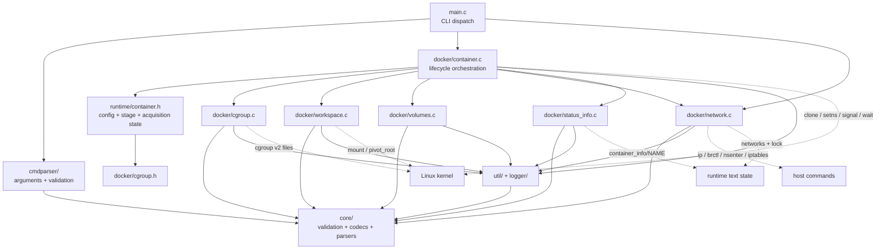
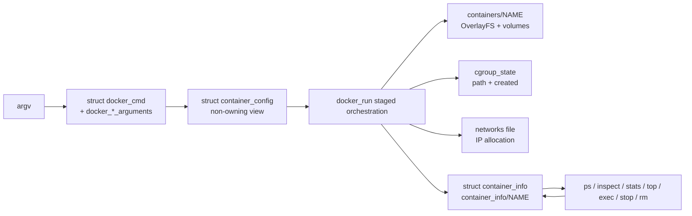

# tinydocker 架构说明

本文面向维护者，描述当前工作区中的真实实现。源码、公共头文件和测试是事实来源；若本文、`README.md` 或历史笔记发生冲突，应以源码和回归测试为准。

## 项目目标与边界

tinydocker 是一个用 C 编写的教学型 Linux 容器运行时。它把 Linux namespace、cgroup v2、OverlayFS、`pivot_root(2)`、veth/bridge/iptables、进程同步和文本状态文件连接成一条可阅读的启动路径。

当前实现刻意保持轻量：CLI 进程直接管理宿主机资源，没有 daemon，不兼容 OCI Runtime Specification，也没有 user namespace、rootless、seccomp、capability 收敛、镜像仓库或 CNI。特权路径只适合在可丢弃的 Linux VM 中学习和验证，不能当作生产安全边界。

## 核心数据结构

当前代码没有一个名为 `ContainerState` 的统一结构。CLI 输入之外，状态分成启动配置、单次 acquisition state 和持久状态三层：

| 数据 | 定义 | 生命周期与所有权 |
|---|---|---|
| `struct docker_run_arguments` | `cmdparser/cmdparser.h` | CLI 解析结果；拥有/引用原始命令参数，是现有命令层接口 |
| `struct container_config` | `runtime/container.h` | `docker_run()` 内构造的只读、非 owning 视图；引用 `docker_run_arguments` 的字符串和数组，目前主要由 cgroup 阶段消费 |
| `struct container_runtime_state` | `runtime/container.h` | 单次启动尝试的临时状态；记录 `enum container_stage` 和拥有的 `struct cgroup_state` |
| `struct container_info` | `core/container_state.h` | 持久化容器状态；由 `docker/status_info.c` 写入 `container_info/NAME`，供 `ps/inspect/stats/top/exec/stop/rm` 使用 |

`container_config` 不复制字符串，不能比 `docker_run_arguments` 活得更久。`container_runtime_state.cgroup.created` 是资源所有权标志：只有本次 `cgroup_prepare()` 确实创建的目录才由 `cgroup_cleanup()` 删除。

## 当前模块职责

| 模块 | 当前职责 | 主要接口 |
|---|---|---|
| `main.c` | 解析后分派命令；仅为 `run` 初始化完整运行环境，为 `network create` 初始化运行目录 | `main()` |
| `cmdparser/` | GNU argp/手工参数解析、输入校验、命令参数结构、现有参数回显 | `parse_docker_cmd()`、`print_docker_cmds()`、`parse_volume_config()` |
| `runtime/` | 启动配置视图、阶段枚举、已迁移子系统的 acquisition state | `struct container_config`、`struct container_runtime_state` |
| `docker/container.c` | 生命周期编排以及尚未拆出的进程/namespace 细节；同时承载所有 lifecycle/observability 命令 | `docker_run()`、`docker_exec()`、`docker_stop()`、`docker_rm()` 等 |
| `docker/cgroup.c` | cgroup v2 创建、限制、进程加入、指标/进程读取和清理 | `cgroup_prepare()`、`cgroup_apply()`、`cgroup_cleanup()` 及兼容接口 |
| `docker/workspace.c` | 镜像目录/归档处理、OverlayFS workspace、mount namespace 内 root 切换 | `init_container_workerspace()`、`init_and_set_new_root()` |
| `docker/volumes.c` | bind volume 挂载、只读 remount、逆序卸载 | `mount_volumes()`、`umount_volumes()` |
| `docker/network.c` | network state、bridge/veth、IP、路由、DNAT、MASQUERADE 配套操作 | `create_network()`、`connect_container()`、`set_container_port_map()` 等 |
| `docker/status_info.c` | `container_info` 构造、原子写入、安全读取、lazy refresh、列举和删除 | `create_container_info()`、`write_container_info()`、`read_container_info()` 等 |
| `core/` | 不执行容器生命周期的可测试基础能力：校验、codec、cgroup 文本解析、安全路径、无 shell 子进程执行 | `td_*` 系列接口 |
| `util/` | SHA-256、tar 调用、目录兼容 helper、时间格式化 | `calculate_sha256()`、`extract_tar()`、`create_tar()` 等 |
| `logger/` | 进程内日志级别、回调和 stderr 输出 | `log_*` 宏与 `log_log()` |
| `tests/` | 非特权单元/黑盒测试与显式 opt-in 的特权集成测试 | `make test`、`make privileged-test` |

当前并不存在独立的 `namespace/`、`filesystem/`、`network namespace/` 或 `process/` 目录。namespace 的 `clone()`、`setns()`、signal 和 wait 主要仍在 `docker/container.c`；filesystem 则横跨 `docker/workspace.c`、`docker/volumes.c` 和 `core/fs.c`。维护时必须以这个实际边界为准。

## 模块依赖图

实线表示当前主要编译依赖，虚线表示系统或持久化边界。



这个图也暴露两个现存边界问题：`runtime/container.h` 直接包含 `docker/cgroup.h`，而 `docker/container.c` 又包含 runtime 头；`docker/cgroup.c`、`docker/network.c`、`docker/status_info.c` 还直接依赖 `cmdparser/cmdparser.h` 的命令结构。它们是当前技术债，不应在新代码中继续扩散。

## 主要数据流



运行目录由 `core/config.h` 的编译期宏确定。默认布局为：

```text
/home/xanarry/tinydocker_runtime/
├── container_info/NAME
├── containers/NAME/{upperdir,workdir,mountpoint}
├── images/SHA256/
├── logs/NAME
├── networks
└── networks.lock
```

cgroup 路径不在运行目录内，而是 `TINYDOCKER_CGROUP_PARENT/tinydocker-NAME`。

## 关键设计决策

1. **无 daemon，CLI 直接编排。** `main()` 调用 `docker_*()`，状态通过文件和内核资源恢复。因此 `refresh_container_status_if_needed()` 采用 lazy refresh，而不是后台事件循环。
2. **父进程最后授权 exec。** `docker_run()` 创建 pipe 后 `clone()`；父进程完成 cgroup、network、port map 和 metadata 后只写字节 `'1'`。`child_fn()` 收不到准确授权就 `_exit(125)`。
3. **关键系统调用保持可见。** `clone()`、`setns()`、`mount()`、`SYS_pivot_root`、`execve()`、`waitpid()` 都位于对应流程附近，没有被隐藏进通用框架。
4. **cgroup 采用显式 acquisition state。** `cgroup_prepare/apply/cleanup` 使用 `struct cgroup_state` 追踪路径与所有权，失败时只释放本次创建的资源。
5. **文本状态严格解析。** `core/status_codec.c` 和 `core/network_state.c` 拒绝重复/未知/非法字段；metadata 与 network state 使用同目录临时文件、`fsync()` 和 rename 发布。network writer 还使用 `flock()` 序列化写者。
6. **外部命令不用 shell。** `core/process.c` 的 `td_run_command()`/`td_capture_command()` 使用 `fork()` + `execvp()`；workspace、network 和 commit 都传 argv 数组，避免拼接 shell 命令。
7. **清理偏保守。** mount 可能仍存在时，`clean_container_runtime()` 和 `cleanup_run_failure()` 拒绝递归删除 workspace；常规 `rm` 只有在全部清理成功时才删除 metadata。
8. **宿主机全局资源与容器资源分离。** 默认 bridge 和 POSTROUTING MASQUERADE 由 `init_docker_env()` 确保存在，不属于单个容器，容器 cleanup 不删除它们。

## 依赖方向约束

维护现有代码时采用以下约束，避免进一步增加耦合：

- `core/` 是最低层：不得包含 `docker/`、`runtime/`、`cmdparser/` 或 `main.c` 的头，也不得创建 namespace、mount、cgroup 或网络资源。
- `cmdparser/` 可以调用 `core/safety.*`，但不得调用 lifecycle 实现或修改宿主资源。
- `runtime/` 只保存生命周期语义、阶段和子系统状态；不得放入大量 `mount/setns/iptables` 细节。
- subsystem 实现可以依赖 `core/`、日志和必要系统 API；新接口优先接收自身 config/state，不应新增对完整 `docker_*_arguments` 的依赖。
- `docker/container.c` 是编排层，可以依赖 subsystem 接口；subsystem 不应反向调用 `docker_run()` 或其他编排命令。
- `main.c` 只做命令适配和 dispatch，不增加 namespace、mount、cgroup、network 细节。
- 持久化格式、CLI 文本和公共函数名属于行为边界；改变它们必须先增加兼容测试，不能借目录整理顺手修改。

当前代码对这些约束有两处已知例外：`runtime/container.h -> docker/cgroup.h`，以及多个
`docker/*.c -> cmdparser/cmdparser.h`。这些是后续小步处理的 seam，不是一次性搬目录的理由。

## README 与源码的一致性说明

`README.md` 的启动图和编号步骤已按当前代码修正：
`docker/container.c:child_fn()` 先调用 `init_and_set_new_root()`，该函数在
`docker/workspace.c` 中完成 private mount propagation、bind mount、`pivot_root`、旧 root
卸载和 `/proc` 挂载，然后子进程才读取 pipe；授权字节只 gate 最后的 `execve()`。

README 也分别记录两条 cleanup 顺序：常规 `docker_rm()` 的
`clean_container_runtime()` 先卸载 volume/rootfs，再清网络；启动失败的
`cleanup_run_failure()` 则先 kill/reap child、关闭 pipe、清端口/veth/IP，再卸载
volume/rootfs。调试时应按对应函数判断资源所有权。

## 架构上的刻意非目标

不要把项目迁移成 OCI runtime、引入 runc/containerd、设计插件系统，或用通用抽象隐藏关键 Linux 系统调用。`clone()`、`pivot_root()`、cgroup 文件写入、veth 配置和父子 pipe 是项目的教学核心，应保持短调用链和可直接下断点。
