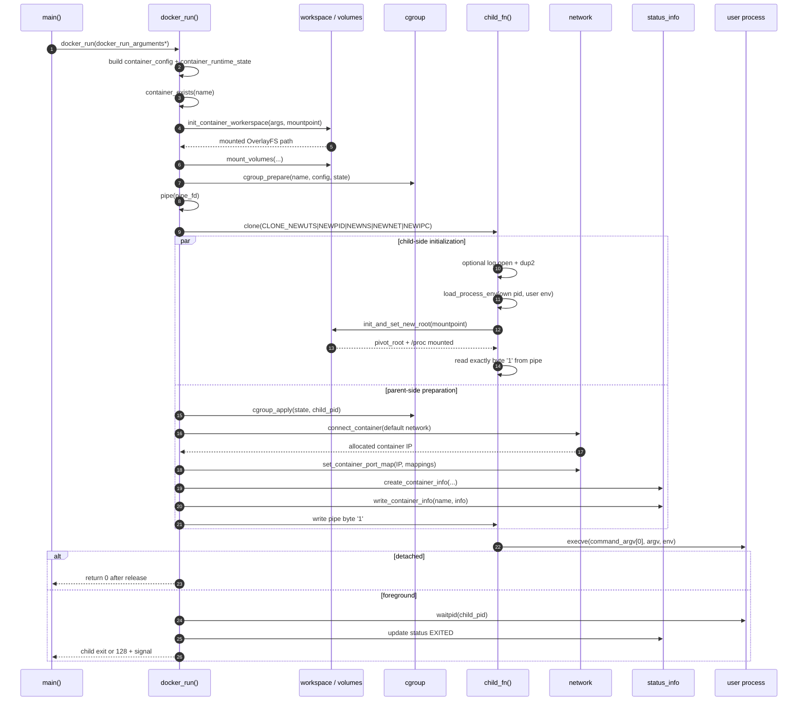
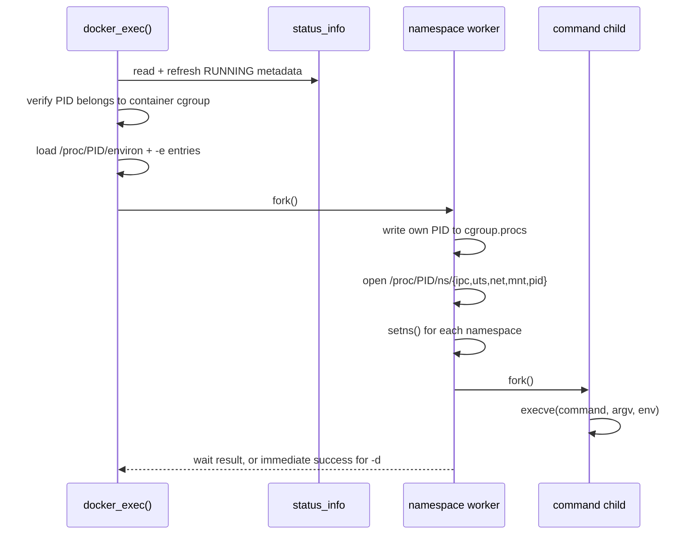

# tinydocker 代码走读

本文从 `main.c:main()` 出发，按当前源码解释命令如何执行、数据如何流动、资源由谁释放以及错误如何返回。完整的外部行为基线见 `docs/behavior-baseline.md`。

## 1. 程序入口与命令分派

`main()` 的第一步是：

```text
argv
-> cmdparser/cmdparser.c:parse_docker_cmd()
-> struct docker_cmd { cmd_type, arguments }
-> main.c:switch
-> print_docker_cmds()（部分命令）
-> docker_*() 或 network 函数
```

解析结果的 `arguments` 指向 `cmdparser/cmdparser.h` 中某个具体结构，例如 `struct docker_run_arguments` 或 `struct docker_exec_arguments`。parser 会校验名称、整数、CIDR、volume 和端口；大量语法错误通过 `exit(-1)` 结束进程，shell 看到的退出码是 255。

分派关系如下：

| 命令 | `main()` 前置动作 | 实现入口 |
|---|---|---|
| `run` | `init_docker_env()`；`print_docker_cmds()` | `docker_run()` |
| `commit` | 参数回显 | `docker_commit()` |
| `ps` | 参数回显 | `docker_ps()` |
| `top` | `print_docker_cmds()` 调用，但该类型没有专门回显内容 | `docker_top()` |
| `exec` | 参数回显 | `docker_exec()` |
| `stop` | 参数回显 | `docker_stop()` |
| `rm` | 参数回显 | `docker_rm()` |
| `inspect` | 无参数回显 | `docker_inspect()` |
| `stats` | 无参数回显 | `docker_stats()` |
| `network create` | `init_runtime_dirs()`；参数回显 | `create_network(..., "bridge")` |
| `network ls` | 无 | `list_network()` |
| `network rm` | 参数回显 | `remove_docker_network()` |

`DOCKER_NETWORK_CONNECT` 和 `DOCKER_NETWORK_DISCONNECT` 虽然在 enum/结构体中存在，但 parser 和 `main()` 没有实现可达命令。

实现函数通常以 `-1` 表示失败；`main()` 把负值转为 `EXIT_FAILURE`，非负值原样返回。因此前台 `run` 和前台 `exec` 的用户进程退出码可以透传。

## 2. `run` 前的宿主机初始化

`main()` 先调用 `docker/container.c:init_docker_env()`：

1. `init_runtime_dirs()` 通过 `make_path()` 确保 runtime root、`container_info/`、`logs/`、`containers/`、`images/` 存在。
2. `docker/network.c:create_default_bridge()` 校验或创建 `tinydocker-0`，其 CIDR 为 `172.11.11.0/24`，网关为 `172.11.11.1/24`。
3. `td_run_command()` 执行 `iptables -t nat -C POSTROUTING ... MASQUERADE`；规则不存在时再以 `-A` 添加。

这些默认网络资源属于宿主机环境，不由某个容器的失败回滚删除。如果此后 `docker_run()` 失败，默认 bridge 和 MASQUERADE 仍会保留。

## 3. 容器启动完整时序



关键并发事实：父进程在配置 cgroup/network/metadata 时，子进程已经进入新 namespace 并执行 rootfs 切换。pipe 阻止的是用户 `execve()`，不是 rootfs 初始化。

## 4. `docker_run()` 的阶段、数据和资源

`runtime/container.h:enum container_stage` 给每个阶段一个可记录的名字，`docker/container.c:container_stage_name()` 将其转换为日志中的 `filesystem.prepare`、`cgroup.apply` 等文本。

| 阶段 | 主要调用 | 读取 | 写入/创建 | 失败时由谁清理 |
|---|---|---|---|---|
| config.prepare | `docker_run()` 内构造 `container_config` | `docker_run_arguments` | 非 owning 配置视图；无外部资源 | 无需清理 |
| container.check | `container_exists()` | runtime/cgroup 路径 | 无；任何已存在 artifact 都拒绝启动 | 直接返回 |
| filesystem.prepare | `init_container_workerspace()` | image 路径、name | image cache、upper/work/mountpoint、OverlayFS mount | `cleanup_run_failure()` 卸载后删 workspace |
| filesystem.volumes | `mount_volumes()` | volume specs、mountpoint | bind mounts；`ro` 时 remount | `mount_volumes()` 局部逆序回滚；总回滚再调用 `umount_volumes()` |
| cgroup.prepare | `cgroup_prepare()` | name、CPU/memory/cpuset | `tinydocker-NAME`、limit files；更新 `cgroup_state` | `cgroup_prepare()` 局部回滚；总回滚 `cgroup_cleanup()` |
| process.pipe | `pipe()` | 无 | `pipe_fd[0..1]` | `cleanup_run_failure()` 关闭 |
| process.clone | `clone()` | `args`、静态 8 MiB child stack | 新 UTS/PID/mount/network/IPC namespace 中的 child | 失败后无 child；成功后的后续失败会 SIGKILL + reap |
| cgroup.apply | `cgroup_apply()` | child PID、`cgroup_state.path` | 写 `cgroup.procs` | 总回滚 kill child，再删 owned cgroup |
| network.prepare | `connect_container()` | name、default network、cgroup PID | IP allocation、veth、bridge attachment、eth0、lo、route | 函数局部回滚；总回滚 disconnect + release IP |
| network.ports | `set_container_port_map()` | IP、port map | OUTPUT/PREROUTING DNAT rules | 局部删除当前 pair；总回滚按 IP 删除全部匹配规则 |
| state.write | `create_container_info()`、`write_container_info()` | args、PID/start time、IP | `struct container_info` 和 `container_info/NAME` | 总回滚 `remove_status_info()` |
| process.release | `write(pipe_fd[1], "1", 1)` | 父进程准备结果 | 允许 child 执行用户命令 | 写失败进入总回滚 |
| process.wait | signal handlers + `waitpid()` | child PID | 前台等待；退出后 metadata 改 `EXITED` | wait 失败只记录并返回，当前不会走 startup cleanup |
| complete | return | wait status 或 detach | 无新资源 | 由之后的 `stop/rm` 管理 |

### Workspace 细节

`docker/workspace.c:init_container_workerspace()`：

- image 是目录时，`realpath()` 后直接作为 OverlayFS lowerdir。
- image 是归档时，`calculate_sha256()` 生成 cache key；cache miss 时在临时目录调用 `extract_tar()`，成功后 rename 为 `images/SHA256`。
- 为容器创建 `upperdir`、`workdir`、`mountpoint`，再 `mount("overlay", ..., "lowerdir=...,upperdir=...,workdir=...")`。
- 把 mountpoint 写入 `args->mountpoint`，供 child 和后续命令使用。

`init_and_set_new_root()` 在 child 的 mount namespace 内直接展示关键系统调用：

```text
mount(NULL, "/", MS_REC|MS_PRIVATE)
-> mount(new_root, new_root, MS_REC|MS_BIND)
-> SYS_pivot_root(new_root, old_root)
-> chdir("/")
-> umount2("/old_root", MNT_DETACH)
-> mount("proc", "/proc", "proc", MS_NOEXEC|MS_NOSUID|MS_NODEV)
```

### Child 初始化与退出码

`child_fn()` 的顺序是：detached log 重定向、`load_process_env()`、root 切换、pipe 授权、`execve()`。环境默认继承启动 CLI 的 `environ`，再追加 `-e KEY=VALUE` 条目。

- 日志文件打开/`dup2()`、环境或 rootfs 初始化失败：`_exit(126)`。
- pipe EOF、短读或字节不是 `'1'`：`_exit(125)`。
- `execve()` 失败：`_exit(127)`。

前台模式由父进程安装 `SIGINT/SIGTERM/SIGHUP` handler，将信号转发到 `foreground_child_pid`，`waitpid()` 后恢复原 handler。detached 模式在授权成功后直接返回，进程最终退出需要由后续 `ps/inspect/stats` lazy refresh 才把陈旧的 `RUNNING` 改为 `EXITED`。

## 5. 失败回滚与正常删除不是同一条路径

### 启动失败：`cleanup_run_failure()`

实际顺序：

```text
SIGKILL + waitpid child（如已 clone）
-> close both pipe fds（如已创建）
-> unset DNAT / delete veth / release IP（如已分配 IP）
-> unmount volumes / OverlayFS
-> remove workspace（仅 mount cleanup 确认成功）
-> cgroup_cleanup()（仅 owned cgroup）
-> remove_status_info()
```

进入回滚前，`docker_run()` 会记录 `container startup failed: stage=... container=...`。`tests/test_full_function.sh` 特别覆盖 `cgroup.prepare` 和 `cgroup.apply` 失败，验证 workspace、metadata、child 和 owned cgroup 不残留。

### 正常删除：`docker_rm()` -> `clean_container_runtime()`

`docker_rm()` 先读取/刷新 metadata，仍为 `RUNNING` 就拒绝删除。允许删除时的顺序为：

```text
rebuild volume configs from metadata
-> unmount volumes / OverlayFS
-> unset DNAT / delete veth / release IP
-> remove workspace（mount 已确认卸载）
-> remove_cgroup()
-> remove metadata（只有此前全部成功）
```

重复删除不存在的状态文件/目录按成功处理。mount cleanup 不确定时保留 workspace 和 metadata，便于人工检查和重试。

## 6. 其余生命周期命令

### `commit`

`docker_commit()` 检查 `containers/NAME/mountpoint` 存在，然后 `util/utils.c:create_tar()` 通过 `td_run_command({"tar", "-czf", ...})` 生成归档。它是当前 mountpoint 的 gzip tar 快照，不是 OCI image。

### `ps`、`inspect`、`stats`、`top`

- `docker_ps()` -> `list_containers_info()` -> `read_container_info()` -> `refresh_container_status_if_needed()`，默认只打印 RUNNING，`-a` 打印全部。
- `docker_inspect()` 读取并可能刷新 metadata，计算 cgroup/rootfs 路径和可用性；端口未持久化，因此固定输出 `PortMappings: unavailable`。
- `docker_stats()` 读取 `cpu.stat`、`memory.current/max`、`cpu.max`、`pids.current/max`；缺失值显示 `N/A`。
- `docker_top()` 从 `cgroup.procs` 读取 PID 列表，再无 shell 执行 `ps -f -p PID,...`。

上述 read-like 命令并非完全无写入：发现 PID 消失或复用时，lazy refresh 会把 metadata 从 `RUNNING` 原子改写为 `EXITED`。

### `exec`



宿主 CLI 父进程本身不会进入容器 cgroup/namespace；进入的是 fork 出来的 worker。`-i`、`-t` 被解析但当前没有 PTY/interactive plumbing。

### `stop`

`docker_stop()` 通过 `get_container_processes_id()` 获取 cgroup PIDs，先逐个发 `SIGTERM`，按 100 ms 间隔轮询至 `-t` 指定时长；仍有进程时发 `SIGKILL`，再最多等待约 2 秒。只有确认 cgroup 无进程后才写 `STOPPED`。

### Network 命令

`create_network()` 创建 bridge、设置 `ifalias=tinydocker-network:NAME`、写 network metadata、配置第一个 host IP 并 link up；任何阶段失败会按已创建资源回滚。`delte_network()` 删除前核对 alias、类型和 ifindex，避免删除非本项目资源。函数名中的拼写错误是现有公共接口。

## 7. 状态文件与错误传播

`docker/status_info.c` 负责文件系统 I/O，`core/status_codec.c` 负责纯文本 codec。写入采用同目录临时文件、`fflush()`、文件 `fsync()` 和 `renameat()`；读取使用 `O_NOFOLLOW`，限制 1 MiB，拒绝非普通文件、NUL、重复/未知字段和 name/file mismatch。

错误传播有四条主要路径：

1. parser 错误：通常 stdout 提示 + `exit(-1)` -> shell 255。
2. host/runtime 错误：底层保留 `errno` 或记录日志，向上返回 `-1` -> `main()` 返回 1。
3. container child 错误：125/126/127；前台透传，后台可能在父进程已经返回后才发生。
4. 用户进程退出：前台 `docker_run()`/`docker_exec()` 返回用户退出码；被信号终止时返回 `128 + signal`。

日志实现 `logger/log.c` 使用进程内全局状态 `L`，默认写 stderr 并带文件/行号。启动失败阶段名是定位 rollback 范围的第一条线索。
