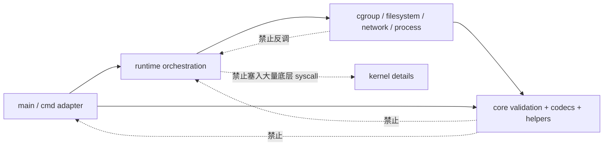

# tinydocker 模块维护指南

本文回答“一个修改应该放在哪里、哪些文件要一起看、哪些依赖不能新增”。它描述当前边界，也指出尚未完成的边界；不把目标结构当作现状。

## 目录与主要文件

### 根目录

| 文件 | 职责 | 维护提示 |
|---|---|---|
| `main.c` | CLI 命令 dispatch、`run`/`network create` 的前置初始化、退出码归一化 | 新命令只应增加薄分派；不要把 mount/cgroup/network 系统调用放进来 |
| `makefile` | Linux runtime、Debug/Release、非特权测试、strict compile、sanitizer、格式目标 | 新 `.c` 文件必须加入正确的 source group；保持默认 `make` 兼容 |
| `README.md` | 用户入口、能力与风险概述 | 流程描述必须与代码同步；当前顺序是 child 先切换 root，再等待授权 |
| `demo.sh` | 显式 opt-in 的特权演示 | 只在 disposable Linux VM/root 下运行；只清理脚本拥有的资源 |
| `busybox.tar.xz` | 示例 rootfs 归档 | 是测试/演示输入，不是镜像管理模块 |
| `test.c` | 早期实验文件 | 不在 Makefile 中且当前不能编译；不要把它当测试入口或生产实现 |
| `network`、`iplist.txt`、`a.png`、`b.png`、`c.png` | 历史样例/说明素材 | 不被当前构建和运行代码读取 |

### `cmdparser/`

- `cmdparser.h` 定义 `enum docker_command_type`、所有 `docker_*_arguments`、`key_val_pair`、`port_map`、`volume_config`。
- `cmdparser.c` 同时包含 GNU argp handler、手工子命令解析、校验和参数回显。

公共接口：`parse_docker_cmd()`、`print_docker_cmds()`、`parse_volume_config()`。

新增/调整 CLI 参数通常需要一起修改 `cmdparser.h`、`cmdparser.c`、`tests/test_cmdparser.c`、`tests/test_cli_blackbox.sh` 和 `docs/behavior-baseline.md`。若参数影响运行，还要修改消费该字段的 subsystem/编排代码，但不应让 parser 直接调用 subsystem。

### `runtime/`

`runtime/container.h` 当前只有数据和阶段：

- `enum container_stage`：启动日志与失败定位。
- `struct container_config`：对已校验 run 参数的非 owning 视图。
- `struct container_runtime_state`：本次启动已获取资源，目前只包含 `cgroup_state`。

公共接口就是这些类型，没有 `.c` 实现。新增 subsystem state 只有在它确实解决“失败时不知道资源是否由本次调用创建”的问题时才应加入，不能把所有局部变量机械搬入 state。

### `docker/container.c` 与 `docker/container.h`

这是当前最大的模块。它包含：

- runtime 初始化：`init_runtime_dirs()`、`init_docker_env()`；
- run 编排：`docker_run()`、`child_fn()`、`cleanup_run_failure()`；
- 正常删除：`clean_container_runtime()`；
- lifecycle/observability：`docker_commit()`、`docker_ps()`、`docker_top()`、`docker_exec()`、`docker_stop()`、`docker_rm()`、`docker_inspect()`、`docker_stats()`；
- namespace/process 细节：`clone()`、`setns()`、signals、`waitpid()`、`execve()`、读取 `/proc/PID/environ`。

`container.h` 是命令层到 lifecycle 的公共接口。修改 `docker_run()` 的阶段顺序时至少一起检查 `runtime/container.h`、对应 subsystem、`cleanup_run_failure()`、`tests/test_full_function.sh`、`docs/code-walkthrough.md`。

### `docker/cgroup.c` 与 `docker/cgroup.h`

职责：检测 cgroup v2、构造 `tinydocker-NAME` 路径、创建目录、写 `memory.max`/`cpu.max`/`cpuset.cpus`、写 `cgroup.procs`、读 PID/cgroup files、删除 cgroup。

首选生命周期接口：

```c
int cgroup_prepare(const char *, const struct cgroup_config *, struct cgroup_state *);
int cgroup_apply(struct cgroup_state *, pid_t);
int cgroup_cleanup(struct cgroup_state *);
```

现有接口仍有明确调用者：`cgroup_prepare()` 复用 `init_cgroup()` 和
`set_cgroup_limits()`，`docker_exec()` 使用 `apply_cgroup_limit_to_pid()`，
`clean_container_runtime()` 使用 `remove_cgroup()`，`top/stop/network` 等路径使用
`get_container_processes_id()`。没有迁移调用方和回归测试时不能删除这些接口。

修改 cgroup 文件语义时一起检查 `core/cgroup_parse.*`、`docker/container.c`、`tests/test_runtime_state.c`、`tests/test_full_function.sh` 和 stats/top/stop 行为。

### `docker/workspace.c`、`docker/volumes.c`

`workspace.c` 负责 image lowerdir/cache、OverlayFS upper/work/mountpoint 和 child root switch。公共接口为 `init_container_workerspace()` 与 `init_and_set_new_root()`。

`volumes.c` 负责 bind mount、只读 remount 和逆序卸载。公共接口为 `mount_volumes()` 与 `umount_volumes()`。

修改 workspace layout 必须一起检查 `docker/container.c` 中 path/cleanup、`docker/status_info.c` 中 volume 持久化、`docker_commit()`、`demo.sh` 和特权测试。修改 volume 格式还涉及 `cmdparser/`、`core/safety.*`、`core/status_codec.*`；该格式是兼容边界。

### `docker/network.c` 与 `docker/network.h`

职责跨度较大：network 文本状态 I/O/锁、bridge ownership、IP allocation、veth、namespace 内地址/路由、DNAT 和命令适配。

公共接口包括：

- network lifecycle：`create_network()`、`create_default_bridge()`、`delte_network()`、`list_network()`、`remove_docker_network()`；
- state/IP：`alloc_new_ip()`、`release_used_ip()`；
- container attachment：`connect_container()`、`disconnect_container()`；
- port rules：`set_container_port_map()`、`unset_container_port_map()`。

修改 network state 格式要一起检查 `core/network_state.*`、`tests/test_core.c`、`tests/test_runtime_state.c`。修改 veth/bridge ownership 要检查 alias 生成、ifindex 验证和 rollback。当前 `connect_container()` 对非默认网络仍硬编码 `/24` 和默认 gateway，不要在无行为决策时顺手“修正”。

### `docker/status_info.c` 与 `docker/status_info.h`

职责：把 run 参数/PID/IP 转换为 `struct container_info`，安全读写 metadata、更新状态、lazy refresh、列举和删除。

公共接口：`create_container_info()`、`write_container_info()`、`read_container_info()`、`update_container_status()`、`refresh_container_status_if_needed()`、`list_containers_info()`、`remove_status_info()`。

metadata 字段或校验变化必须一起修改 `core/container_state.h`、`core/status_codec.*`、`tests/test_core.c`、`tests/test_runtime_state.c`、`docs/behavior-baseline.md`，并确认旧记录兼容。`pid_start_time` 当前是可缺失的 legacy 字段。

### `core/`

| 文件 | 职责 | 公共接口特征 |
|---|---|---|
| `config.h` | 编译期 runtime/cgroup 路径宏 | 仅常量 |
| `container_state.h` | `container_status`、持久态 `container_info` | 数据结构 |
| `safety.c/.h` | 名称/整数/port/volume/CIDR/path/proc/veth/archive 校验 | `td_validate_*`、`td_parse_*`、`td_build_*` |
| `status_codec.c/.h` | container metadata 纯解析/写出 | `td_parse_container_info()`、`td_write_container_info()` |
| `network_state.c/.h` | network record 纯解析/写出/唯一性 | `td_parse_network_record()` 等 |
| `cgroup_parse.c/.h` | cgroup 文本、byte、PID 列表解析 | `td_parse_cgroup_stat()` 等 |
| `fs.c/.h` | 物理遍历删除；rootfs 下无 symlink 目录创建 | `td_remove_tree()`、`td_ensure_directory_beneath()` |
| `process.c/.h` | 无 shell 的 fork/exec 与 stdout capture | `td_run_command()`、`td_capture_command()` |

`core/` 应保持可在 macOS 上编译测试，且不得依赖 `docker/`、`runtime/` 或 GNU argp。纯 codec/校验应优先放这里；真实 mount/network/cgroup 副作用不应放这里。

### `util/` 与 `logger/`

`util/utils.c` 是历史兼容 utility 集合：OpenSSL SHA-256、tar 列举/解包/打包、目录 helper、时间格式化。它依赖 `core/fs`、`core/process`、`core/safety` 和 logger。新功能应优先判断是否属于明确 subsystem 或 `core/`，不要继续把无关 helper 堆进 `utils.c`。

`logger/log.c` 是 rxi log 的轻量实现。公共接口在 `log.h`，全局状态 `L` 保存 level、quiet、lock 和 callbacks。它不负责错误码翻译或资源 rollback。

### `tests/`、`scripts/`、`.github/`

- `test_core.c`：纯校验、codec、fs/process helper、幂等 cleanup。
- `test_cmdparser.c`：GNU argp 解析、参数回显、当前错误文案；仅 Linux 构建执行。
- `test_runtime_state.c`：在临时 runtime/cgroup 目录测试 metadata、network allocation/concurrency、cgroup state ownership。
- `test_cli_blackbox.sh`：无副作用 CLI 错误输出、退出码和 runtime 不变性。
- `run_privileged.sh`：opt-in gate 与 suite 分派。
- `test_observability.sh`：真实 `run/inspect/stats/ps` lazy refresh。
- `test_full_function.sh`：真实容器、volume、exec、stop/rm、network/port/commit，以及 cgroup 失败 rollback。
- `scripts/build.sh`：`make`/`make debug`/`make release` 薄封装。
- `scripts/test.sh`：`make check` 薄封装。
- `.github/workflows/ci.yml`：Ubuntu build、非特权测试、strict compile、sanitizers；不执行特权 suite。

## 公共头文件接口速查

项目没有安装为独立版本化 C library，但以下声明构成目录之间的当前源级接口。维护者应把名称、参数与结构字段视为兼容面。

| 头文件 | 导出内容 |
|---|---|
| `cmdparser/cmdparser.h` | `docker_command_type`、所有 `docker_*_arguments` 与 `key_val_pair`/`port_map`/`volume_config`；`parse_volume_config()`、`parse_docker_cmd()`、`print_docker_cmds()` |
| `runtime/container.h` | `container_stage`、`container_config`、`container_runtime_state` |
| `docker/container.h` | `init_docker_env()`、`init_runtime_dirs()`、`docker_run()`、`docker_commit()`、`docker_ps()`、`docker_top()`、`docker_exec()`、`docker_stop()`、`docker_rm()`、`docker_inspect()`、`docker_stats()` |
| `docker/cgroup.h` | `cgroup_config`、`cgroup_state`；`cgroup_prepare/apply/cleanup()`；legacy `init_cgroup()`、`remove_cgroup()`、`apply_cgroup_limit_to_pid()`、`set_cgroup_limits()`；process/path readers |
| `docker/workspace.h` | `init_and_set_new_root()`、`init_container_workerspace()` |
| `docker/volumes.h` | `mount_volumes()`、`umount_volumes()` |
| `docker/network.h` | default network constants；`delte_network()`、`create_default_bridge()`、`create_network()`、`alloc_new_ip()`、`release_used_ip()`、`list_network()`、`remove_docker_network()`、connect/disconnect、port map set/unset、`get_first_cidr_host_ip()` |
| `docker/status_info.h` | metadata create/read/write/update/refresh/list/remove；通过前置声明保持独立可包含 |
| `core/config.h` | `TINYDOCKER_RUNTIME_DIR`、`TINYDOCKER_CGROUP_PARENT` 与 derived runtime path macros |
| `core/container_state.h` | `container_status`、`container_info` |
| `core/safety.h` | name/number/port/volume/CIDR parsers；runtime/rootfs path builders；proc start-time parser；veth name 与 archive entry 校验 |
| `core/cgroup_parse.h` | `td_parse_cgroup_stat()`、`td_format_bytes()`、`td_parse_cgroup_pid_list()` |
| `core/network_state.h` | `td_network_record` 与容量常量；record parse/format/name uniqueness |
| `core/status_codec.h` | `td_parse_container_info()`、`td_write_container_info()` |
| `core/fs.h` | `td_remove_tree()`、`td_ensure_directory_beneath()` |
| `core/process.h` | `td_run_command()`、`td_capture_command()` |
| `util/utils.h` | path/dir helpers、`split_string()`、tar extract/create、SHA-256、timestamp formatting |
| `logger/log.h` | log event/callback types、level enum、`log_*` macros、level/quiet/lock/callback setters、`log_log()` |

## 哪些文件通常一起修改

| 修改主题 | 最小共同审查集合 |
|---|---|
| 新 CLI 参数/命令 | `cmdparser.h/.c`、`main.c`、目标 `docker/*.h/.c`、parser/CLI tests、behavior baseline |
| run 阶段顺序 | `docker/container.c`、`runtime/container.h`、目标 subsystem、startup failure tests、walkthrough |
| cgroup lifecycle | `docker/cgroup.h/.c`、`runtime/container.h`、`docker/container.c`、runtime-state/full tests |
| metadata 字段/格式 | `core/container_state.h`、`core/status_codec.*`、`docker/status_info.*`、所有读者、codec/runtime-state tests |
| network state 格式 | `core/network_state.*`、`docker/network.*`、core/runtime-state tests |
| workspace/volume layout | `docker/workspace.*`、`docker/volumes.*`、`docker/container.c` cleanup、status metadata、privileged tests |
| build source/flags | `makefile`、`scripts/*.sh`、`.github/workflows/ci.yml`、README/debugging docs |

## 新功能应该放在哪里

- 新命令语法：`cmdparser/`；`main.c` 只加一条薄 dispatch。
- 新的生命周期阶段：先在 `runtime/container.h` 表达阶段/必要 state，再在 `docker/container.c` 编排；底层副作用放到对应 subsystem。
- 纯文本格式或不触发宿主副作用的校验：`core/`，并直接加 `test_core.c`。
- cgroup 文件操作：`docker/cgroup.c`；解析可下沉到 `core/cgroup_parse.c`。
- mount/pivot/rootfs：当前放 `docker/workspace.c` 或 `docker/volumes.c`，不要放 `main.c`。
- bridge/veth/IP/routes/iptables：当前放 `docker/network.c`；若以后拆分，应先按 state、link、port 三个真实职责小步切，不设计插件系统。
- PID、clone/setns/exec/signal/wait：当前在 `docker/container.c`；只在有回归测试时抽取小的 process seam，必须保留关键系统调用可见性。
- 日志：使用现有 `log_*`；不要新增另一套日志框架。

## 禁止新增的依赖方向



具体规则：

- 禁止 `core/` include `docker/`、`runtime/`、`cmdparser/`。
- 禁止 subsystem 调用 `main()`、`parse_docker_cmd()` 或其他顶层命令编排函数。
- 禁止新 subsystem 接口直接接收整个 `struct docker_run_arguments`；应只接收其真正需要的 config/state。现有 workspace/volume/status 接口是待渐进迁移的例外。
- 禁止把持久化 I/O 混进纯 codec；`status_info.c`/`network.c` 做 I/O，`core/*_state.c`/`status_codec.c` 做解析。
- 禁止从 logger 触发业务行为或 cleanup。

## 不建议拆分或抽象的部分

- `init_and_set_new_root()` 中连续的 mount、`pivot_root`、旧 root 卸载和 `/proc` 挂载：这是一个有强顺序约束的教学单元。
- `child_fn()` 的 pipe 授权检查与 `execve()`：调用链应保持直接可读。
- `docker_exec()` 中 open namespace fd、`setns()`、再 fork command 的核心顺序：可提取资源关闭 helper，但不应隐藏到通用“namespace engine”。
- `cgroup_prepare/apply/cleanup`：现有三段式接口已经对应真实资源生命周期，不需要工厂、插件或虚函数式抽象。
- `core/status_codec.c`、`core/network_state.c`：它们是边界清晰、可直接测试的纯模块，不要为每个字段再创建对象层。
- `logger/log.c`：体量小且来源明确，除非真实线程安全需求变化，不需要包装层。

公共拼写 `delte_network()`、`init_container_workerspace()` 虽不理想，但当前属于源级兼容面；没有迁移计划和兼容 wrapper 时不要仅为改名制造大范围 diff。
